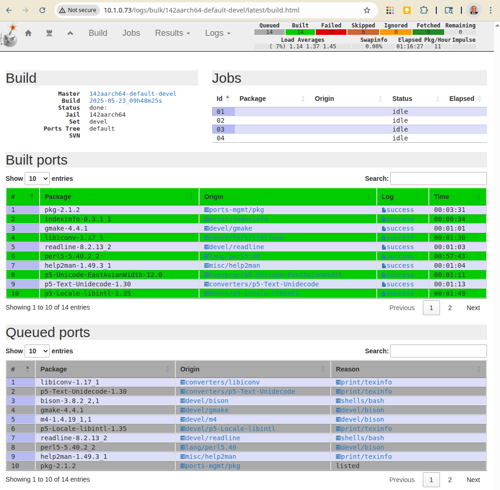

Build aarch64 ports listed in the file arm/minimal
""""""""""""""""""""""""""""""""""""""""""""""""""

::

   shell> poudriere bulk -j 142aarch64 -z devel -f /usr/local/etc/poudriere.d/pkglist/arm/minimal

[http://10.1.0.73/logs/bulk/142aarch64-default-devel/latest/build.html]

