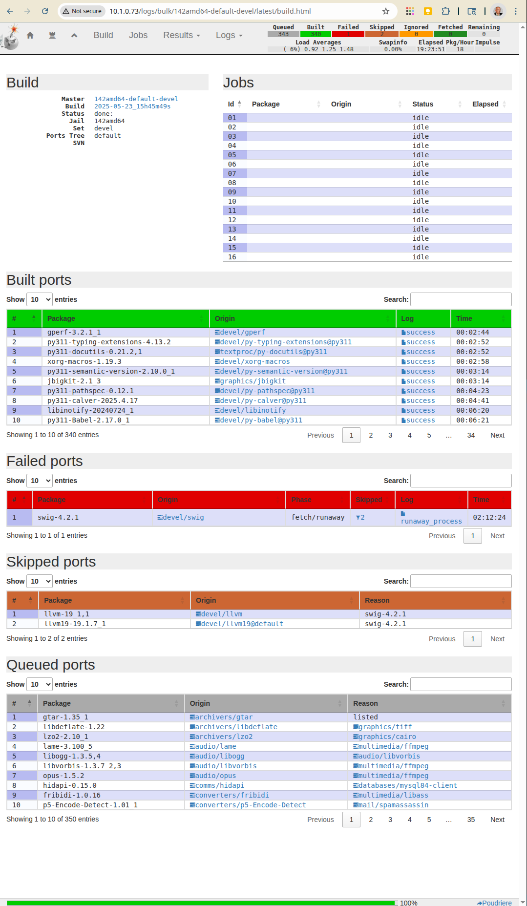

Build amd64 ports listed in the file All
""""""""""""""""""""""""""""""""""""""""

::

  shell>  poudriere bulk -j 142amd64 -z devel -f /usr/local/etc/poudriere.d/pkglist/amd64.enabled/All
  ...
  [19:23:51] Failed ports: devel/swig:fetch/runaway
  [19:23:51] Skipped ports: devel/llvm devel/llvm19@default
  [142amd64-default-devel] [2025-05-23_15h45m49s] [committing] Queued: 343 Built: 340 Failed: 1   Skipped: 2   Ignored: 0   Fetched: 0   Tobuild: 0    Time: 19:23:45

[http://10.1.0.73/logs/bulk/142amd64-default-devel/latest/build.html]

