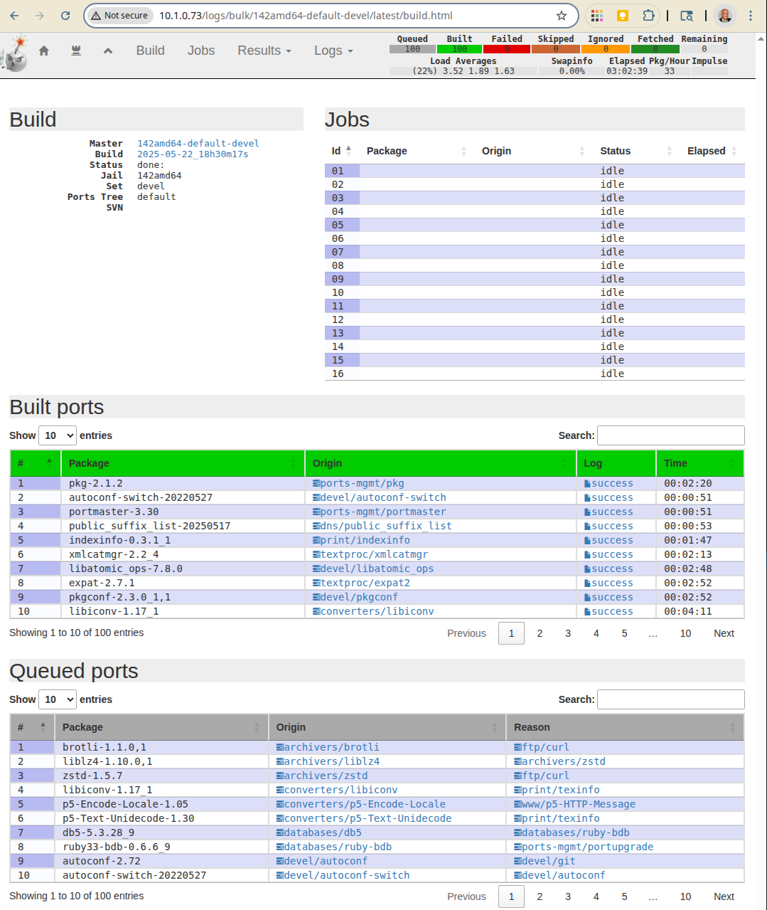

Build amd64 ports listed in the file minimal
""""""""""""""""""""""""""""""""""""""""""""

::

   shell> poudriere bulk -j 142amd64 -z devel -f /usr/local/etc/poudriere.d/pkglist/amd64/minimal

[http://10.1.0.73/logs/bulk/142amd64-default-devel/latest/build.html]

