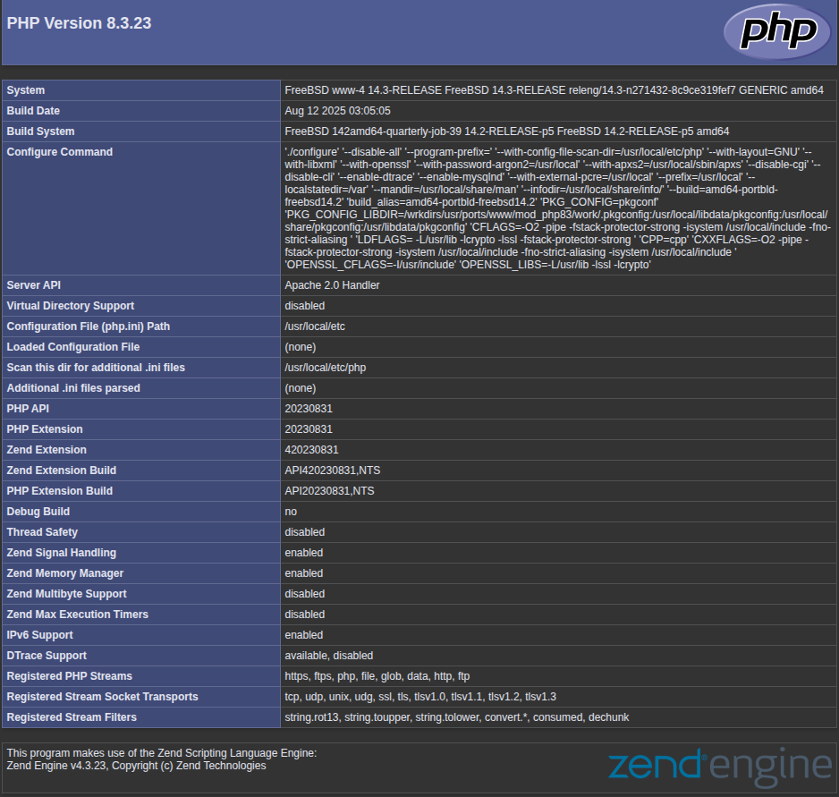

.. _example_422:

422 Role vbotka.freebsd.apache PHP
----------------------------------

.. contents::
   :local:
   :depth: 1

.. index:: single: Apache PHP; Example 422
.. index:: single: mod_php; Example 422
.. index:: single: Apache HTTP Server; Example 422
.. index:: single: role vbotka.freebsd.apache; Example 422
.. index:: single: vbotka.freebsd.apache; Example 422

.. index:: single: iocage host_hostname; Example 422
.. index:: single: host_hostname; Example 422

Use case
^^^^^^^^

Use the role `vbotka.freebsd.apache`_ to configure PHP in `Apache HTTP Server`_. Use iocage property
``host_hostname`` to create a jail.

Tree
^^^^

::

  shell> tree .
  .
  ├── ansible.cfg
  ├── hosts
  ├── host_vars
  │   ├── iocage_04
  │   │   └── ansible-client-apache.yml
  │   └── www-4
  │       └── apache.yml
  ├── iocage.ini
  └── pb-apache.yml

Synopsis
^^^^^^^^

* The playbook `vbotka.freebsd.pb_iocage_ansible_clients.yml`_ creates and starts one jail.
* The playbook ``pb-apache.yml`` configures PHP in the `Apache HTTP Server`_ in the jail.

Requirements
^^^^^^^^^^^^

* Template ``ansible_client_apache`` created in :ref:`example_209`

Notes
^^^^^

* ``iocage`` option ``--name`` provides "NAME instead of a UUID for the new jail".

* ``iocage`` property ``host_hostname`` provides "The hostname of the jail. Default: UUID".

* Make sure DHCP and dynamic DNS are configured so that ``host_hostname`` and
  ``--name`` resolve.

.. seealso::

   * `FreeBSD Handbook 32.9. Apache HTTP Server`_
   * `FreeBSD Handbook 32.9.3.3. mod_php`_
   * `Apache HTTP Server`_
   * `PHP manual Apache PHP`_
   * `PHP manual phpinfo`_
   * `man 8 iocage`_

ansible.cfg
^^^^^^^^^^^

.. literalinclude:: ansible.cfg
   :language: ini

Inventory iocage.ini
^^^^^^^^^^^^^^^^^^^^

.. literalinclude:: iocage.ini
   :language: ini

host_vars
^^^^^^^^^

.. literalinclude:: host_vars/iocage_04/ansible-client-apache.yml
   :language: yaml
   :caption:

.. literalinclude:: host_vars/www-4/apache.yml
   :language: yaml
   :caption:

Create and start jails
^^^^^^^^^^^^^^^^^^^^^^

.. code-block:: console

   (env) > ansible-playbook vbotka.freebsd.pb_iocage_ansible_clients.yml \
                            -i iocage.ini \
                            -t clone_host_hostname -e clone_host_hostname=true

.. literalinclude:: out/out-01.txt
   :language: yaml
   :force:

Inventory hosts
^^^^^^^^^^^^^^^

.. literalinclude:: hosts
   :language: ini
   :caption:

Playbook pb-apache.yml
^^^^^^^^^^^^^^^^^^^^^^^

.. literalinclude:: pb-apache.yml
   :language: yaml

Playbook output - Create server
^^^^^^^^^^^^^^^^^^^^^^^^^^^^^^^

.. code-block:: console

   (env) > ansible-playbook pb-apache.yml -i hosts

.. literalinclude:: out/out-02.txt
   :language: yaml
   :force:

Create info.php
^^^^^^^^^^^^^^^

.. code-block:: console

   (env) > ssh admin@www-4 cat /usr/local/www/apache24/data/info.php
   <?php
   phpinfo();
   ?>

Results
^^^^^^^

* Test the configuration

  .. code-block:: console

     (env) > ssh admin@www-4 sudo service apache24 configtest
     Performing sanity check on apache24 configuration:
     Syntax OK

* In a browser, open the page ``http://www-4/info.php``. The content should be

.. _vbotka.freebsd.apache: https://galaxy.ansible.com/ui/repo/published/vbotka/freebsd/content/role/apache/
.. _vbotka.freebsd.pb_iocage_ansible_clients.yml: https://galaxy.ansible.com/ui/repo/published/vbotka/freebsd/content/playbook/pb_iocage_ansible_clients.yml

.. _FreeBSD Handbook 32.9. Apache HTTP Server: https://docs.freebsd.org/en/books/handbook/network-servers/#network-apache
.. _FreeBSD Handbook 32.9.3.3. mod_php: https://docs.freebsd.org/en/books/handbook/network-servers/#_mod_php
.. _Apache HTTP Server: https://httpd.apache.org/
.. _PHP manual Apache PHP: https://www.php.net/manual/en/book.apache.php
.. _PHP manual phpinfo: https://www.php.net/manual/en/function.phpinfo.php
.. _man 8 iocage: https://man.freebsd.org/cgi/man.cgi?query=iocage
