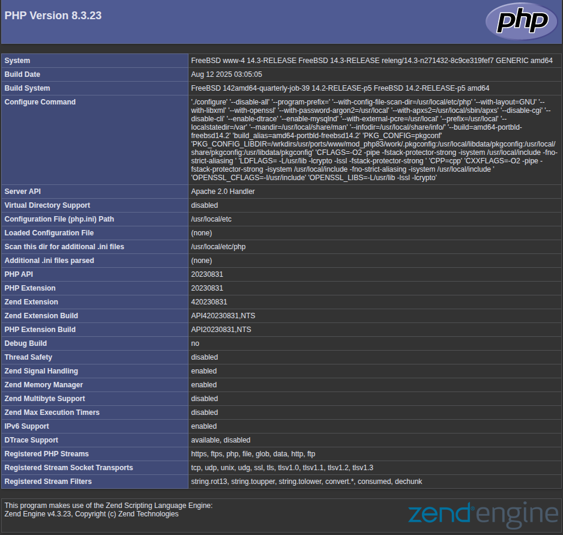

.. _example_422:

422 Role vbotka.freebsd.apache PHP
----------------------------------

.. contents::
   :local:
   :depth: 1

.. index:: single: Apache PHP; Example 422
.. index:: single: mod_php; Example 422
.. index:: single: Apache HTTP Server; Example 422
.. index:: single: role vbotka.freebsd.apache; Example 422
.. index:: single: vbotka.freebsd.apache; Example 422

Use case
^^^^^^^^

Use the role `vbotka.freebsd.apache`_ to configure PHP in `Apache HTTP Server`_.

Tree
^^^^

::

  shell> tree .
  .
  ├── ansible.cfg
  ├── files
  │   └── info.php
  ├── hosts
  │   ├── 06_iocage2.yml
  │   └── 99_constructed.yml
  ├── host_vars
  │   ├── iocage_06
  │   │   └── ansible-client-apache.yml
  │   └── www-4
  │       └── apache.yml
  ├── iocage.ini
  ├── pb-apache.yml
  └── pb-data.yml

Synopsis
^^^^^^^^

On a managed node:

* The playbook `vbotka.freebsd.pb_iocage_ansible_clients.yml`_ creates and starts one jail.
* The playbook ``pb-data.yml`` creates the file data/info.php
* The playbook ``pb-apache.yml`` configures PHP in the `Apache HTTP Server`_.

Requirements
^^^^^^^^^^^^

* Template ``ansible-client-apache`` created in :ref:`example_209`

Notes
^^^^^

TBD

.. seealso::

   * `FreeBSD Handbook 32.9. Apache HTTP Server`_
   * `FreeBSD Handbook 32.9.3.3. mod_php`_
   * `Apache HTTP Server`_
   * `PHP manual Apache PHP`_
   * `PHP manual phpinfo`_
   * `man 8 iocage`_

ansible.cfg
^^^^^^^^^^^

.. literalinclude:: ansible.cfg
   :language: ini

Inventory iocage.ini
^^^^^^^^^^^^^^^^^^^^

.. literalinclude:: iocage.ini
   :language: ini

hosts
^^^^^

.. literalinclude:: hosts/06_iocage2.yml
   :language: yaml+jinja
   :caption:

.. literalinclude:: hosts/99_constructed.yml
   :language: yaml+jinja
   :caption:

host_vars
^^^^^^^^^

.. literalinclude:: host_vars/iocage_06/ansible-client-apache.yml
   :language: yaml
   :caption:

.. literalinclude:: host_vars/www_4/apache.yml
   :language: yaml
   :caption:

Create and start jails
^^^^^^^^^^^^^^^^^^^^^^

.. code-block:: console

   (env) > ansible-playbook -i iocage.ini \
                            -t clone_host_hostname -e clone_host_hostname=true \
			    vbotka.freebsd.pb_iocage_ansible_clients.yml

.. literalinclude:: out/out-01.txt
   :language: yaml
   :force:

Playbook pb-data.yml
^^^^^^^^^^^^^^^^^^^^

.. literalinclude:: pb-data.yml
   :language: yaml+jinja

Playbook output - Create data/php.info for Apache HTTP Server
^^^^^^^^^^^^^^^^^^^^^^^^^^^^^^^^^^^^^^^^^^^^^^^^^^^^^^^^^^^^^

.. code-block:: console

   (env) > ansible-playbook -i hosts pb-data.yml

.. literalinclude:: out/out-02.txt
   :language: yaml
   :force:

Playbook pb-apache.yml
^^^^^^^^^^^^^^^^^^^^^^^

.. literalinclude:: pb-apache.yml
   :language: yaml+jinja

Playbook output - Configure and start server
^^^^^^^^^^^^^^^^^^^^^^^^^^^^^^^^^^^^^^^^^^^^

.. code-block:: console

   (env) > ansible-playbook -i hosts pb-apache.yml

.. literalinclude:: out/out-03.txt
   :language: yaml
   :force:

Inventory graph
^^^^^^^^^^^^^^^
.. code-block:: console

   shell > ansible-inventory -i hosts --graph

.. literalinclude:: out/out-04.txt
   :language: sh

List jails
^^^^^^^^^^

.. code-block:: console

   shell > ssh admin@iocage_06 sudo iocage list -l

.. literalinclude:: out/out-05.txt
   :language: sh

Results
^^^^^^^

* Test the configuration

  .. code-block:: console

     [iocage_06]# iocage exec www-4 service apache24 configtest
     Performing sanity check on apache24 configuration:
     Syntax OK

* In a browser, open the page ``http://www-4/info.php``. The content should be
  similar to this one if the URL resolves.

.. _vbotka.freebsd.apache: https://galaxy.ansible.com/ui/repo/published/vbotka/freebsd/content/role/apache/
.. _vbotka.freebsd.pb_iocage_ansible_clients.yml: https://galaxy.ansible.com/ui/repo/published/vbotka/freebsd/content/playbook/pb_iocage_ansible_clients.yml

.. _FreeBSD Handbook 32.9. Apache HTTP Server: https://docs.freebsd.org/en/books/handbook/network-servers/#network-apache
.. _FreeBSD Handbook 32.9.3.3. mod_php: https://docs.freebsd.org/en/books/handbook/network-servers/#_mod_php
.. _Apache HTTP Server: https://httpd.apache.org/
.. _PHP manual Apache PHP: https://www.php.net/manual/en/book.apache.php
.. _PHP manual phpinfo: https://www.php.net/manual/en/function.phpinfo.php
.. _man 8 iocage: https://man.freebsd.org/cgi/man.cgi?query=iocage
