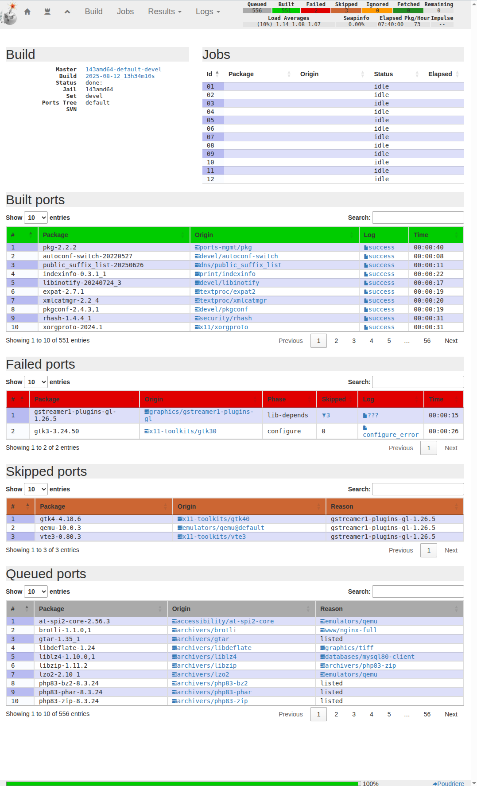

.. _example_423:

423 Role vbotka.freebsd.apache Poudriere
----------------------------------------

.. contents::
   :local:
   :depth: 1

.. index:: single: Poudriere data; Example 423
.. index:: single: Apache Virtual Host; Example 423
.. index:: single: Apache HTTP Server; Example 423
.. index:: single: role vbotka.freebsd.apache; Example 423
.. index:: single: vbotka.freebsd.apache; Example 423

.. index:: single: certificate; Example 423
.. index:: single: SSL certificate; Example 423
.. index:: single: role vbotka.freebsd.certificate; Example 423
.. index:: single: vbotka.freebsd.certificate; Example 423

.. index:: single: fstab; Example 423
.. index:: single: mount; Example 423
.. index:: single: iocage allow_mount; Example 423
.. index:: single: iocage allow_mount_zfs; Example 423
.. index:: single: iocage jail_zfs; Example 423
.. index:: single: allow_mount; Example 423
.. index:: single: allow_mount_zfs; Example 423
.. index:: single: jail_zfs; Example 423

Use case
^^^^^^^^

Mount host directory ``/usr/local/poudriere`` in the jail.  Use the role
`vbotka.freebsd.certificate`_ to create SSL certificate for
``build.foo.bar``. Use the role `vbotka.freebsd.apache`_ to configure `Apache
HTTP Server Virtual Host`_ ``build.foo.bar`` to access ``/usr/local/poudriere``.

Tree
^^^^

::

  shell> tree .
  .
  ├── ansible.cfg
  ├── hosts
  │   ├── 06_iocage2.yml
  │   └── 99_constructed.yml
  ├── host_vars
  │   ├── iocage_06
  │   │   └── ansible-client-apache.yml
  │   └── www_5
  │       ├── apache.yml
  │       └── certificate.yml
  ├── iocage.ini
  ├── pb-apache.yml
  └── pb-certificate.yml

Synopsis
^^^^^^^^

On a managed node:

* The playbook `vbotka.freebsd.pb_iocage_ansible_clients.yml`_ creates
  and starts one jail. Mounts host directory ``/usr/local/poudriere``
  in the jail.

* The playbook ``pb-certificate.yml`` creates SSL certificate for
  ``build.foo.bar``.

* The playbook ``pb-apache.yml`` uses the certificate, configures, and
  starts `Apache HTTP Server Virtual Host`_ ``build.foo.bar`` in the
  jail.

Requirements
^^^^^^^^^^^^

* Template ``ansible-client-apache`` created in :ref:`example_209`

Notes
^^^^^

TBD

.. seealso::

   * `How Do I Mount Host Datasets Inside Jails`_
   * `FreeBSD Handbook 32.9. Apache HTTP Server`_
   * `FreeBSD Handbook 32.9.2. Virtual Hosting`_
   * `Apache HTTP Server Virtual Host`_
   * `Apache HTTP Server - SSL/TLS Strong Encryption`_
   * `man 8 iocage`_

ansible.cfg
^^^^^^^^^^^

.. literalinclude:: ansible.cfg
   :language: ini

Inventory iocage.ini
^^^^^^^^^^^^^^^^^^^^

.. literalinclude:: iocage.ini
   :language: ini

hosts
^^^^^

.. literalinclude:: hosts/06_iocage2.yml
   :language: yaml+jinja
   :caption:

.. literalinclude:: hosts/99_constructed.yml
   :language: yaml+jinja
   :caption:

host_vars
^^^^^^^^^

.. literalinclude:: host_vars/iocage_06/ansible-client-apache.yml
   :language: yaml+jinja
   :caption:

.. literalinclude:: host_vars/www_5/apache.yml
   :language: yaml+jinja
   :caption:

.. literalinclude:: host_vars/www_5/certificate.yml
   :language: yaml+jinja
   :caption:

Create and start the jail
^^^^^^^^^^^^^^^^^^^^^^^^^

.. code-block:: console

   (env) > ansible-playbook -i iocage.ini \
                            -t create_host -e create_host=true \
			    vbotka.freebsd.pb_iocage_ansible_clients.yml

.. literalinclude:: out/out-01.txt
   :language: yaml+jinja
   :force:

Playbook pb-certificate.yml
^^^^^^^^^^^^^^^^^^^^^^^^^^^

.. literalinclude:: pb-certificate.yml
   :language: yaml+jinja

Playbook output - Display variables
^^^^^^^^^^^^^^^^^^^^^^^^^^^^^^^^^^^

.. code-block:: console

   (env) > ansible-playbook -i hosts \
                            -t certificate_debug -e certificate_debug=true \
			    pb-certificate.yml

.. literalinclude:: out/out-02.txt
   :language: yaml+jinja
   :force:

Playbook output - Setup
^^^^^^^^^^^^^^^^^^^^^^^

.. code-block:: console

   (env) > ansible-playbook -i hosts -t certificate_setup pb-certificate.yml

.. literalinclude:: out/out-03.txt
   :language: yaml+jinja
   :force:

Playbook output - Create certificate
^^^^^^^^^^^^^^^^^^^^^^^^^^^^^^^^^^^^

.. code-block:: console

   (env) > ansible-playbook -i hosts -t certificate_openssl pb-certificate.yml

.. literalinclude:: out/out-04.txt
   :language: yaml+jinja
   :force:

Playbook output - Display status
^^^^^^^^^^^^^^^^^^^^^^^^^^^^^^^^

.. code-block:: console

   (env) > ansible-playbook -i hosts -t certificate_openssl_stat pb-certificate.yml

.. literalinclude:: out/out-05.txt
   :language: yaml+jinja
   :force:

Playbook pb-apache.yml
^^^^^^^^^^^^^^^^^^^^^^^

.. literalinclude:: pb-apache.yml
   :language: yaml+jinja

Playbook output - Configure and start server
^^^^^^^^^^^^^^^^^^^^^^^^^^^^^^^^^^^^^^^^^^^^

.. code-block:: console

   (env) > ansible-playbook -i hosts pb-apache.yml

.. literalinclude:: out/out-07.txt
   :language: yaml+jinja
   :force:

Inventory graph
^^^^^^^^^^^^^^^
.. code-block:: console

   shell > ansible-inventory -i hosts --graph

.. literalinclude:: out/out-08.txt
   :language: sh

List jails
^^^^^^^^^^

.. code-block:: console

   shell > ssh admin@iocage_06 sudo iocage list -l

.. literalinclude:: out/out-09.txt
   :language: sh
      
Results
^^^^^^^

* Test the configuration

  .. code-block:: console

     [iocage_06]# iocage exec www-5 service apache24 configtest
     Performing sanity check on apache24 configuration:
     Syntax OK

* If the URL resolves, open the logs. For example,

| https://build.foo.bar/logs/bulk/143amd64-default-devel/2025-08-12_13h34m10s/build.html

|

.. seealso::

   :ref:`example_390`

.. _Apache HTTP Server - SSL/TLS Strong Encryption: https://httpd.apache.org/docs/2.4/ssl/ssl_howto.html
.. _vbotka.freebsd.apache: https://galaxy.ansible.com/ui/repo/published/vbotka/freebsd/content/role/apache/
.. _vbotka.freebsd.certificate: https://galaxy.ansible.com/ui/repo/published/vbotka/freebsd/content/role/certificate/
.. _vbotka.freebsd.pb_iocage_ansible_clients.yml: https://galaxy.ansible.com/ui/repo/published/vbotka/freebsd/content/playbook/pb_iocage_ansible_clients.yml

.. _How Do I Mount Host Datasets Inside Jails: https://www.truenas.com/community/threads/freenas-11-iocage-how-do-i-mount-host-datasets-inside-jails.55193/
.. _FreeBSD Handbook 32.9. Apache HTTP Server: https://docs.freebsd.org/en/books/handbook/network-servers/#network-apache
.. _FreeBSD Handbook 32.9.2. Virtual Hosting: https://docs.freebsd.org/en/books/handbook/network-servers/#_virtual_hosting
.. _Apache HTTP Server: https://httpd.apache.org/
.. _Apache HTTP Server Virtual Host: https://httpd.apache.org/docs/2.4/vhosts/
.. _man 8 iocage: https://man.freebsd.org/cgi/man.cgi?query=iocage
