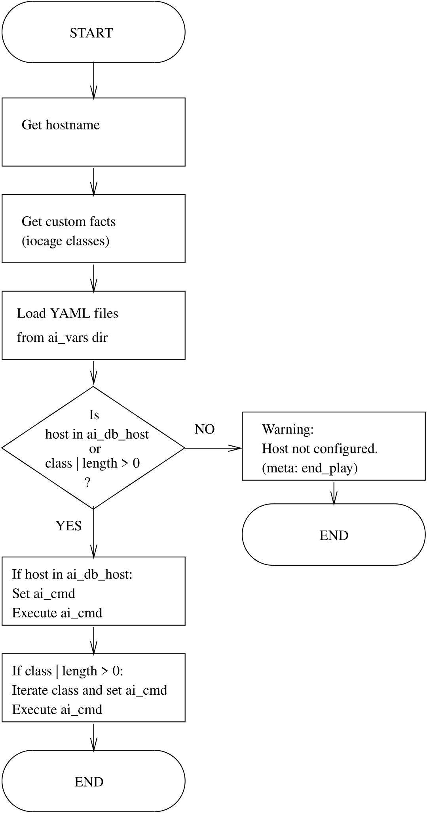

.. _ug_concepts_ansible_conf_init:

Repository ansible-conf-init
----------------------------

.. index:: single: ansible-conf-init; Concepts
.. index:: single: pb-init.yml; Concepts
.. index:: single: ai_db_host; Concepts
.. index:: single: ai_db_class; Concepts

.. contents::
   :local:
   :depth: 2

Overview
^^^^^^^^

The `ansible-conf-init`_ repository provides the first-stage Ansible
configuration and playbook required by the service ``ansible_init`` to
bootstrap remote hosts and jails.

Designed for pull-based initialization workflows (``ansible-pull``) and
automated provisioning pipelines (such as FreeBSD ``jails``, ``VM templates``,
or ``bare-metal`` node bring-up), this repository acts as the initial control
repository that a target machine clones and executes upon ``first boot``.

Playbook pb-init.yml workflow
^^^^^^^^^^^^^^^^^^^^^^^^^^^^^

|

Host and Class Discovery
""""""""""""""""""""""""

The playbook ``pb-init.yml`` executes the ``hostname`` command and saves the
standard output to determine the host identity (``ai_hostname``). Gathers custom
local facts (``ansible_local``) to discover any FreeBSD iocage jail ``classes``
assigned to the system (``ansible_local.iocage.class``) that match configured
database classes (``ai_db_class``).

Variables
"""""""""

Iterates through the directory defined by ``ai_vars`` and dynamically loads all
``.yml`` and ``.yaml`` variable files (populating dictionaries like
``ai_db_host``, ``ai_db_class``, etc.). Outputs debug information showing the
current execution parameters, resolved ``host``, detected ``classes``, and
``project settings``.

Configuration Validation and Early Exit
"""""""""""""""""""""""""""""""""""""""

Checks whether the current ``hostname`` exists in ``ai_db_host`` or if any
matching ``classes`` were found in ``ai_db_class``. If neither condition is met,
prints a warning message and terminates execution early using
``ansible.builtin.meta: end_play``.

Host-Specific Execution Path
""""""""""""""""""""""""""""

Runs if ``ai_hostname`` is found directly in ``ai_db_host``. Constructs an
``ansible-pull`` command using the target host's specific ``repository URL``,
``destination directory``, ``playbook name``, and ``variable flags``. Executes
the generated command by importing ``tasks/execute-cmd.yml``.

Class-Specific Execution Path
"""""""""""""""""""""""""""""

Runs if one or more valid ``classes`` are defined in ``ai_db_class``. Loops
through each matched ``class`` to build a chained, multi-stage ``ansible-pull``
command sequence. Executes the chained commands by importing
``tasks/execute-cmd.yml.``

.. seealso::

   * repository `ansible-conf-init`_
   * repository `ansible-conf-test`_
   * example :ref:`example_524`
   * example :ref:`example_525`

Best Practices
^^^^^^^^^^^^^^

Fork the Repository: Fork `ansible-conf-init`_ into your organization's version
control to lock down dependencies, specify internal collections, and manage
company-specific SSH keys and certificates.

Secure Credentials with Ansible Vault: Never store plaintext secrets (root
passwords, private keys) in public or shared pull repos. Use ``ansible-vault``
with password files or secure key-management integration.

Idempotent Tasks: Ensure all tasks inside the repository are strictly idempotent
so repeated runs via ``ansible-pull`` or ``ansible_init`` do not disrupt running
services.

Local Connection Strategy: Always verify that ``ansible_connection: local`` is
configured in your inventory to avoid SSH self-connection overhead during local
bootstrapping.

.. _ansible-conf-init: https://github.com/vbotka/ansible-conf-init
.. _ansible-conf-test: https://github.com/vbotka/ansible-conf-test
