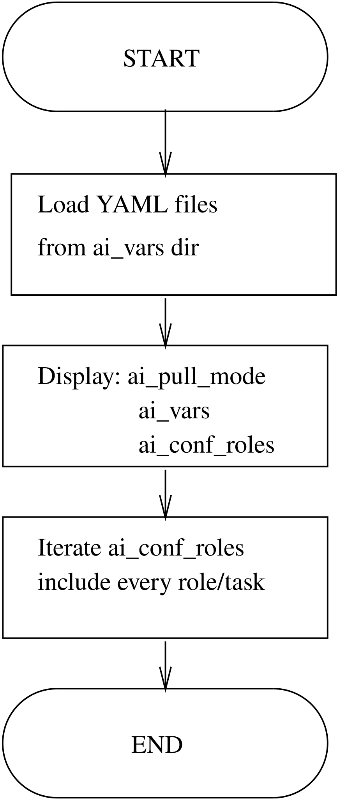

.. _ug_concepts_ansible_conf_roles:

Repository ansible-conf-roles
-----------------------------

.. index:: single: ansible-conf-roles; Repository ansible-conf-roles
.. index:: single: pb-roles.yml; Repository ansible-conf-roles
.. index:: single: ai_conf_roles; Repository ansible-conf-roles
.. index:: single: limited collection; Repository ansible-conf-roles

.. contents::
   :local:
   :depth: 2

Overview
^^^^^^^^

The `ansible-conf-roles`_ repository provides an optional second-stage
Ansible configuration and playbook. This repository can be defined in
``ai_db_host`` and/or ``ai_db_class`` and invoked by the
``pb-init.yml`` playbook from `ansible-conf-init`_.

A minimal subset of the Ansible collection ``vbotka.freebsd`` is
bundled in the ``collections/ansible_collections/vbotka/freebsd/``
directory.

Playbook pb-roles.yml workflow
^^^^^^^^^^^^^^^^^^^^^^^^^^^^^^

|

Variables
"""""""""

The playbook iterates through the directory defined by ``ai_vars`` and
dynamically loads all ``.yml`` and ``.yaml`` variable files
(populating dictionaries like ``ai_conf_roles``). It outputs debug
information showing the current execution parameters. For example:

.. code-block:: yaml+jinja

   ai_conf_roles:
     vbotka.freebsd.packages: [conf, pkg-install]
     vbotka.freebsd.postinstall: [syslogd, syslog-ng]

Dynamic Role and Task Execution
"""""""""""""""""""""""""""""""

The playbook converts the ``ai_conf_roles`` dictionary into a flat
list of role-to-task pairs using the filter expression ``dict2items |
subelements('value')``, then iterates over every role/task
combination:

.. code-block:: yaml+jinja

   - ansible.builtin.include_role:
       name: "{{ oitem.0.key }}"
       tasks_from: "{{ oitem.1 }}"
     loop: "{{ ai_conf_roles | dict2items | subelements('value') }}"
     loop_control:
       loop_var: oitem

.. note::

   Use the task file ``main`` to include the complete role.

Bundling a Limited Collection
^^^^^^^^^^^^^^^^^^^^^^^^^^^^^

Why a Limited Collection is Needed
""""""""""""""""""""""""""""""""""

The upstream ``vbotka.freebsd`` collection is a large collection
containing numerous roles, plugins, and modules for diverse FreeBSD
system administration tasks. Embedding the entire collection into
consumer repositories like ``ansible-conf-roles``,
``ansible-conf-init``, or ``ansible-conf-syslogng-*`` presents several
disadvantages:

* **Repository Size:** Distributing unused roles and assets needlessly
  increases repository clone sizes.

* **Dependency Footprint:** Restricting the collection to only the
  roles and plugins actively referenced (such as ``packages``,
  ``postinstall``, and target modules) ensures predictable
  deployments.

* **Standalone Self-Containment:** Including a subset directly within
  the repository allows environments without outbound internet access
  or access to external Galaxy registries to execute configurations
  out of the box.

Sync Filter Configuration
"""""""""""""""""""""""""

The subset of files to include is maintained via an ``rsync`` filter
file (e.g., ``setup/sync/ansible-conf-roles.txt``). Directories and
files are explicitly whitelisted, while everything else is ignored
during extraction.

.. code-block:: text

   galaxy.yml
   LICENSE
   meta/
   meta/**

   plugins/
   plugins/filter/
   plugins/filter/ast_to_nginx.py
   plugins/filter/dict_to_ast.py
   plugins/filter/from_ucl.py
   plugins/filter/to_ucl.py
   plugins/modules/
   plugins/modules/service.py
   plugins/modules/ucl.py

   roles/
   roles/lib/
   roles/lib/**
   roles/nginx/
   roles/nginx/**
   roles/packages/
   roles/packages/**
   roles/postinstall/
   roles/postinstall/**

   setup/
   setup/sync/
   setup/sync/ansible-conf-roles.txt

Creating and Updating the Limited Collection
""""""""""""""""""""""""""""""""""""""""""""

To extract the minimal collection and install it into the target
repository:

1. **Export the path to the upstream source collection:**

   .. code-block:: console

      shell> export VBOTKA_FREEBSD_COLLECTION_PATH=/scratch/collections/ansible_collections/vbotka/freebsd

2. **Prepare a staging build directory:**

   .. code-block:: console

      shell> mkdir -p ${HOME}/tmp/vbotka.freebsd/setup/sync

3. **Copy the sync manifest and synchronize the subset:**

   Use ``rsync`` with ``--include-from`` to copy only the matching paths from
   the upstream repository into the staging directory:

   .. code-block:: console

      shell> cd ${HOME}/tmp/vbotka.freebsd
      shell> cp ${VBOTKA_FREEBSD_COLLECTION_PATH}/setup/sync/ansible-conf-roles.txt setup/sync/
      shell> rsync -avL --delete-excluded --include-from='setup/sync/ansible-conf-roles.txt' --exclude='*' ${VBOTKA_FREEBSD_COLLECTION_PATH}/ .

4. **Install the staged collection into the local repository:**

   Switch to the target repository, target its local ``collections/``
   path, and force an update/install using ``ansible-galaxy``:

   .. code-block:: console

      shell> cd /scratch/vbotka/vbotka.ansible-conf-roles
      shell> export ANSIBLE_COLLECTIONS_PATH=./collections
      shell> ansible-galaxy collection install -U ${HOME}/tmp/vbotka.freebsd

5. **Commit and push the updated bundle:**

   .. code-block:: console

      shell> git add .
      shell> git commit -a -S -m "Upgrade the limited collection to 1.0.1"
      shell> git push

6. Repeat steps 4 and 5 for any additional consumer repositories (such
   as ``ansible-conf-init``, ``ansible-conf-syslogng-server``, or
   ``ansible-conf-syslogng-client``) using their corresponding sync
   definition files.

.. seealso::

   * Example :ref:`example_528`
   * Repository `ansible-conf-roles`_
